# Software Requirement Specification (SRS)

## Human Resource Management (HRM)

**Group:** Group 1 - SE2014  
**Lecturer:** Nguyen Dinh Manh Linh  
**Location/Time:** Hanoi, June 2026  
**Document:** SWP391 - SRS Document

---

## Table of Contents

- [I. Record of Changes](#i-record-of-changes)
- [II. Software Requirement Specification](#ii-software-requirement-specification)
  - [1. Overall Requirements](#1-overall-requirements)
    - [1.1 Context Diagram and Feature Tree Diagram](#11-context-diagram-and-feature-tree-diagram)
    - [1.2 Main Business Processes](#12-main-business-processes)
    - [1.3 User Requirements](#13-user-requirements)
    - [1.4 System Functionalities](#14-system-functionalities)
    - [1.5 Entity Relationship Diagram](#15-entity-relationship-diagram)
  - [2. Use Case Specifications](#2-use-case-specifications)
    - [2.1 Authentication & Security](#21-authentication--security)
    - [2.2 Employee Management](#22-employee-management)
    - [2.3 Task Management](#23-task-management)
    - [2.4 Mail Requests](#24-mail-requests)
    - [2.5 Payroll](#25-payroll)
    - [2.6 Recruitment](#26-recruitment)
  - [3. Functional Requirements](#3-functional-requirements)
    - [3.1 Login Screen/Function](#31-login-screenfunction)
    - [3.2 User Authentication](#32-user-authentication)
    - [3.3 System Administration](#33-system-administration)
  - [4. Non-Functional Requirements](#4-non-functional-requirements)
    - [4.1 External Interfaces](#41-external-interfaces)
    - [4.2 Quality Attributes](#42-quality-attributes)
  - [5. Requirement Appendix](#5-requirement-appendix)
    - [5.1 Business Rules](#51-business-rules)
    - [5.2 System Messages](#52-system-messages)
    - [5.3 Other Requirements](#53-other-requirements)

---

# I. Record of Changes

| Date | A/M/D | In Charge | Change Description |
|---|---|---|---|
|  |  |  |  |

> **Legend:** A = Added, M = Modified, D = Deleted.

---

# II. Software Requirement Specification

# 1. Overall Requirements

## 1.1 Context Diagram and Feature Tree Diagram

### 1.1.1 Context Diagram

The **Human Resource Management System (HRM)** is an integrated personnel management software that replaces the company’s current manual and fragmented management methods.

The system provides functionalities ranging from:

- Employee profile management
- Mail requests
- Payroll processing
- Recruitment management
- HR reporting

The goal of the system is to digitize the entire HR process, enabling the following roles to operate on a unified platform:

- HR staff
- Department managers
- Administrators
- Employees

#### Context Diagram Actors and Main Interactions

| External Actor / Entity | Main Data / Interaction With HRM |
|---|---|
| Admin | User information, role assignment, system logs |
| HR | Applicant evaluation data, employee information, payroll records, CV, employee records |
| Guest | CV, recruitment result, interview schedule |
| Email | Interview result, rejection mail, approval/rejection notification for HR reports |
| HR Manager | HR reports, approval/rejection for HR reports |
| Department Manager | Mail request, task assignment, approval/rejection, department report, task progress report |
| Employee | Mail request, mail response, task assignment, task status, payroll list |

> The original SRS contains a context diagram image showing HRM at the center and the above actors exchanging data with the system.

---

### 1.1.2 Feature Tree Diagram

#### 1. Authentication & Security

- **Login/Logout:** Users can securely log in and log out of the HRM system.
- **Password Management:** Functions for changing and resetting passwords in case users forget credentials.
- **Role-Based Access Control (RBAC):** The system ensures users can only access features relevant to their assigned roles.

#### 2. Employee Management

- **Profile Management:** Employees can view and request updates to their personal information; HR staff can approve or reject updates.
- **Employment Status Management:** HR staff can update employment status: Active, Intern, Probation, Resigned, Terminated.

#### 3. Task Management

- **Task Assignment:** Department Managers and HR Managers can assign tasks to employees.
- **Task Updates:** Employees can update the progress and status of assigned tasks.
- **Task Approval:** Managers can approve or reject task completion requests.

#### 4. Petition & Request

- **Mail Request Submission:** Employees can submit different types of requests, including Leave, Resignation, and Petition.
- **Request Notification:** Employees receive notifications about the approval or rejection of their requests.
- **Request Approval:** Department Managers and HR staff can review, approve, or reject submitted requests.

#### 5. Payroll

- **Salary Data Management:** HR staff can input contract and salary data.
- **Payroll Calculation:** The system can calculate salaries, including allowances, bonuses, and deductions.
- **Payroll Approval:** HR Managers review and approve payroll before payment.
- **Payslip Access:** Employees can view their payslips online.

#### 6. Recruitment

- **Job Posting:** HR staff can create and post job vacancies.
- **CV Submission:** Guests can submit CVs for open positions.
- **Screening & Evaluation:** HR staff can review and filter applications.
- **Interview Scheduling:** HR staff can schedule interviews for shortlisted candidates.
- **Applicant Notification:** Applicants are notified about interview schedules and final results.

#### 7. Reports & Analytics

- **Report Generation:** The system generates HR, departmental, and system performance reports.
- **Report Viewing:** Different roles, including HR, HR Manager, Department Manager, and Admin, can view reports through the dashboard according to their access rights.

#### 8. System Administration

- **User Management:** Admins can create, edit, delete, search, and filter system user accounts.
- **Role Management:** Admins can assign roles to users and manage permissions.
- **System Logs:** Admins can review system activity logs for auditing and security.

---

## 1.2 Main Business Processes

### 1.2.1 Recruitment Process

The recruitment process involves Guest, HR, and HR Manager.

#### Process Summary

1. Guest sends CV.
2. HR receives and filters CV.
3. HR decides whether the application passes the CV screening.
4. If the application is rejected:
   - Rejection mail is sent.
5. If the application passes:
   - HR schedules interview.
   - HR Manager reviews interview result.
6. HR Manager decides whether the interview is passed.
7. If the interview is rejected:
   - Rejection mail is sent.
8. If the interview is passed:
   - HR Manager proceeds to make contract.

#### Mermaid Process Diagram

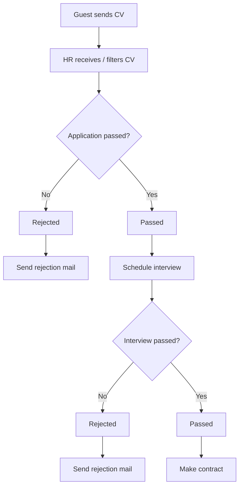

---

### 1.2.2 Make Contract

The make-contract process involves HR, HR Manager, Admin, and Employee.

#### Process Summary

1. HR prepares the contract.
2. HR enters contract data and basic salary.
3. HR Manager screens the contract.
4. HR Manager approves or rejects the contract.
5. If rejected:
   - The contract is returned for revision.
6. If approved:
   - Admin creates new user profile.
   - Admin updates user status to Intern.
   - Admin creates new system account.
   - Employee logs in and updates profile.

#### Mermaid Process Diagram

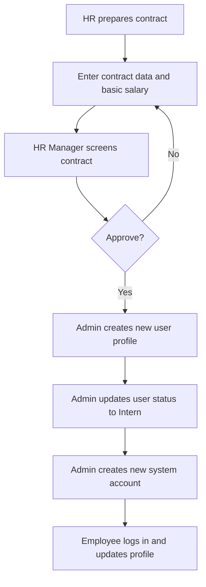

---

### 1.2.3 Payroll

The payroll process involves HR, HR Manager, and Employee.

#### Process Summary

1. HR enters basic salary.
2. HR combines attendance and leave data.
3. HR calculates draft payroll.
4. HR Manager reviews payroll.
5. HR Manager approves or rejects payroll.
6. If rejected:
   - Payroll is returned for correction.
7. If approved:
   - Employee receives payslip.

#### Mermaid Process Diagram

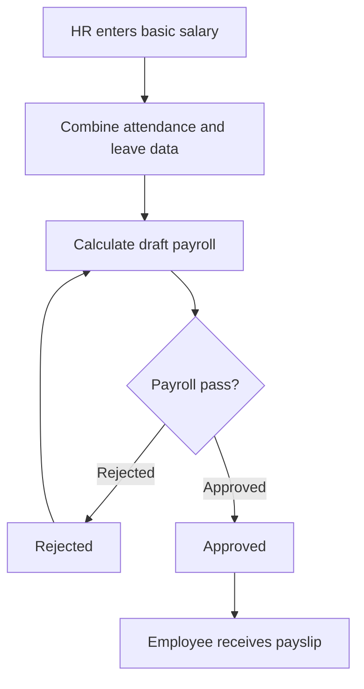

---

### 1.2.4 Employee Management

The employee management process involves Employee, HR, and HR Manager.

#### Process Summary

1. Employee submits edited personal information.
2. HR reviews the request.
3. HR Manager receives notice of profile update activity.
4. HR checks whether the profile request is valid.
5. If invalid:
   - Employee receives rejection notice.
6. If valid:
   - HR updates profile.
   - Employee receives profile update success notice.

#### Mermaid Process Diagram

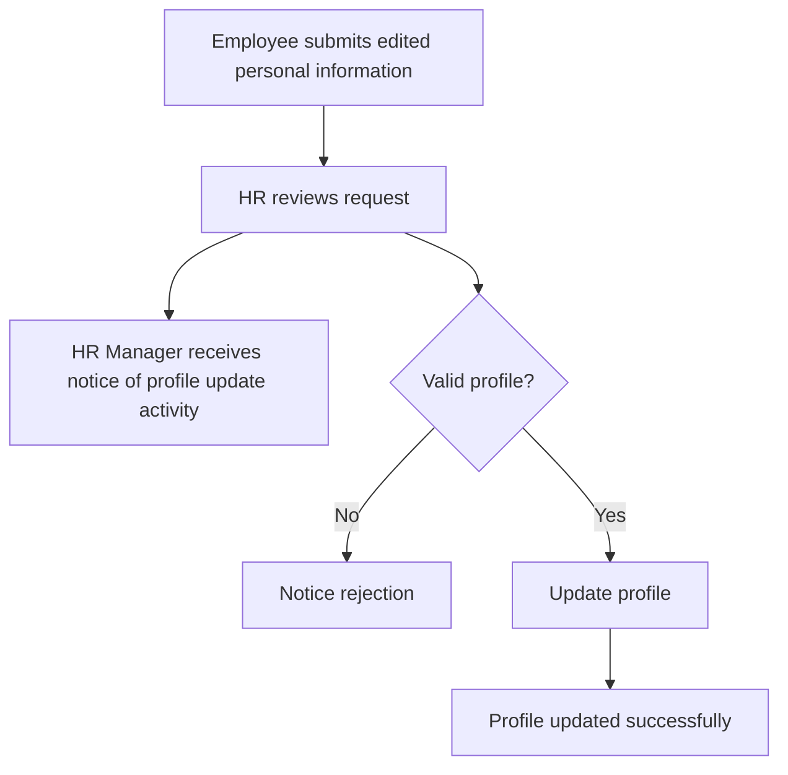

---

### 1.2.5 Task Management

The task management process involves Department Manager and Employee.

#### Process Summary

1. Department Manager creates or assigns task.
2. Employee receives task.
3. Employee updates status and submits report.
4. Department Manager views report.
5. Department Manager approves or rejects report.
6. If rejected:
   - Employee updates again.
7. If approved:
   - Task is marked as done.

#### Mermaid Process Diagram

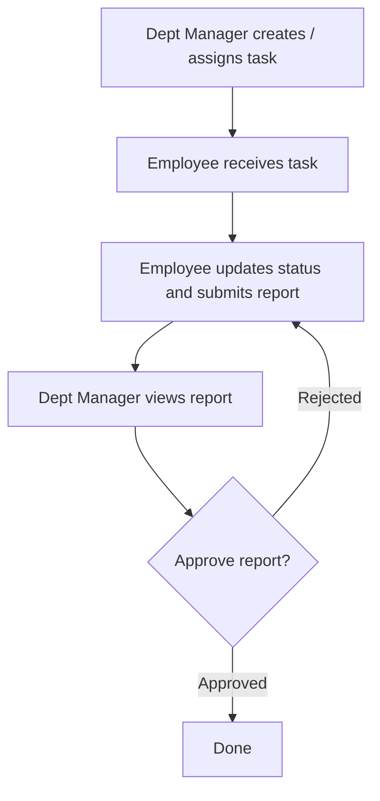

---

## 1.3 User Requirements

### 1.3.1 Actors

| # | Actor | Description |
|---|---|---|
| 1 | Employee | Employees in the company use the system to record attendance, request leave, update personal information, receive assignments, and view payslips. |
| 2 | HR | HR staff are responsible for managing personnel records, entering contracts, monitoring attendance, and calculating salaries. |
| 3 | HR Manager | Manages senior HR, approves payroll, views summary reports, reviews recruitment files, and makes strategic HR decisions. |
| 4 | Dept Manager | Department Head, responsible for assigning work, monitoring progress, approving leave, and reviewing department reports. |
| 5 | Admin | Responsible for system administration, user management, authorization, and activity log monitoring. |
| 6 | Guest | Outsiders who apply for jobs, track office schedules, and receive commissions from HR. |

---

### 1.3.2 Use Cases (UC)

| ID | Use Case | Feature | Use Case Description |
|---|---|---|---|
| 01 | Submit CV | Recruitment | Guests submit their CV to the HRM system for consideration. |
| 02 | View Application Result | Recruitment | Guests view the result of their submitted CV to know whether they passed or not. |
| 03 | View Interview Schedule | Recruitment | Guests can view the interview schedule if their CV has passed the evaluation stage. |
| 04 | View Candidate CV | Recruitment | HR views candidate CV stored in the HRM system. |
| 05 | Submit Application Evaluation | Recruitment | HR sends candidate evaluation data, including decision/recommendation, to the HRM system. |
| 06 | Submit Mail Request | Mail Request | Employees send a mail request through the HRM system. |
| 07 | View Mail Request Response | Mail Request | Employees receive and view responses to their mail requests. |
| 08 | View Payroll / Payslip | Payroll Calculation | Employees view their payroll information provided by HR. |
| 09 | View Assigned Tasks | Task Management | Employee views assigned tasks in the HRM system. |
| 10 | Update Task Status | Task Management | Employees update the progress/status of their assigned tasks. |
| 11 | Collect Employee Records | Payroll Calculation | HR collects attendance data from employee records to calculate payroll. |
| 12 | Submit Payroll Record | Payroll Calculation | HR sends payroll record data to the HRM system for processing. |
| 13 | View Application Evaluation | Recruitment | HR Manager views application evaluation data submitted by HR. |
| 14 | Approve/Reject Application | Recruitment | The HR Manager makes the final decision to approve or reject a candidate’s CV. |
| 15 | Approve/Reject Request | Mail Request | The Dept Manager makes the final decision to approve or reject an employee's request. |
| 16 | View Submitted Mail Requests | Mail Request | Dept Manager views mail requests submitted by employees. |
| 17 | Monitor Task Status | Task Management | Dept Manager views task status submitted by employee. |
| 18 | Approve/Reject Task Completion | Task Management | The Dept Manager makes the final decision to approve or reject an employee’s task completion. |
| 19 | Manage Users | System Administration | Admin adds users, deletes users if resigned, and filters users to find them more easily. |
| 20 | View System Logs | System Administration | Admin views system logs. |
| 21 | Assign User Roles | System Administration | Admin sets roles for users that were created before. |

---

### 1.3.3 Use Case Diagrams

#### 1.3.3.1 UCs for Guest

Guest use cases:

- Submit CV
- View recruitment result
- View interview schedule if result is passed

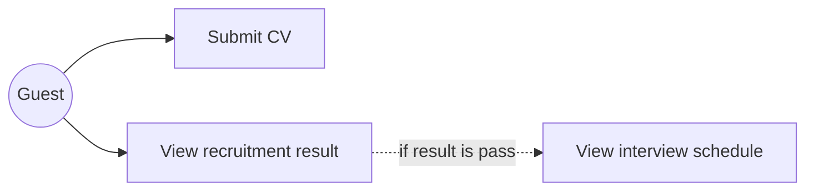

#### 1.3.3.2 UCs for Employee

Employee use cases:

- View task assignment
- Update task status
- Send mail request
- Receive mail response
- View payroll list

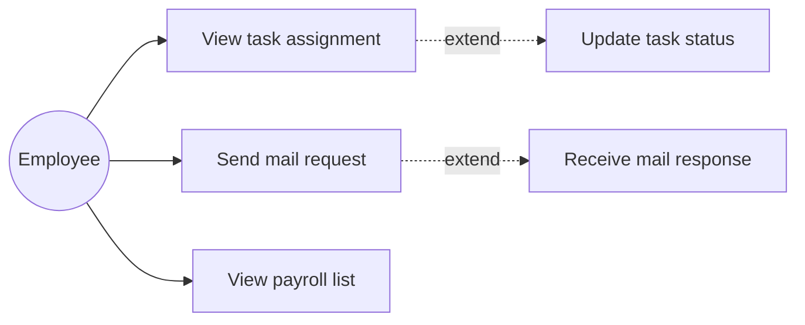

#### 1.3.3.3 UCs for HR Staff

HR Staff use cases:

- Create and post recruitment
- View candidates of guests

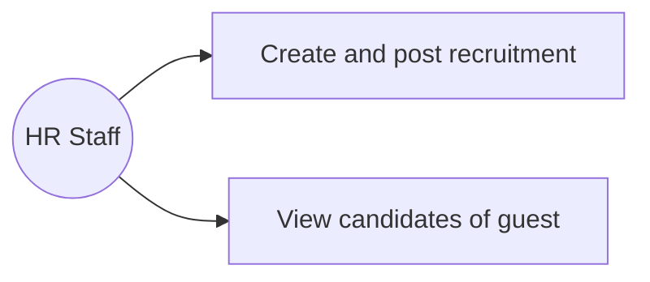

#### 1.3.3.4 UCs for HR Manager

HR Manager use cases:

- View application evaluation data
- Approve or reject CV

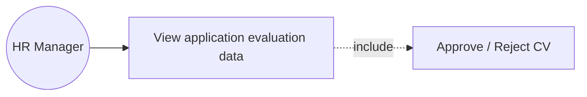

#### 1.3.3.5 UCs for Dept Manager

Department Manager use cases:

- View mail request
- Approve/reject employee requests
- View and update task status
- Approve/reject task completion

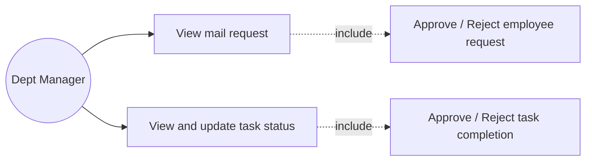

#### 1.3.3.6 UCs for Admin

Admin use cases:

- Add, delete, and filter users
- Manage system logs
- Assign roles for users

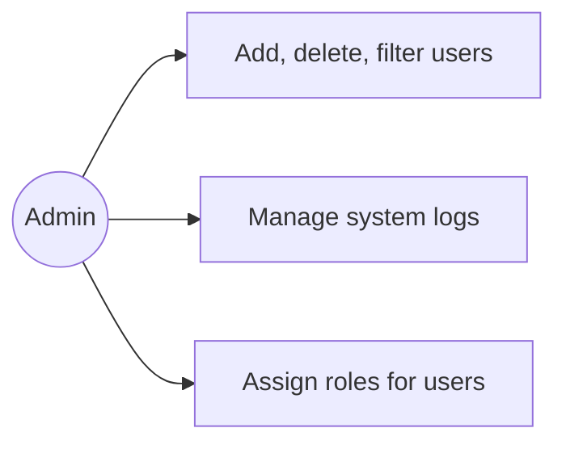

---

## 1.4 System Functionalities

### 1.4.1 Screens Flow

> The original SRS contains a placeholder note: “This part shows the system screens and the relationship among screens. You can draw the Screens Flow for the system in the form of diagram as below.”

A structured screen flow based on the SRS modules:

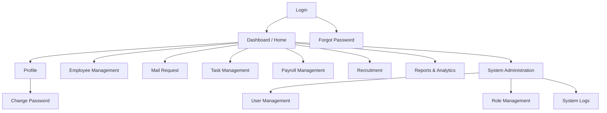

---

### 1.4.2 Screen Authorization

| Screen | HR | HR Manager | Employee | Dept Manager | Admin |
|---|---:|---:|---:|---:|---:|
| Login | X | X | X | X | X |
| Change password | X | X | X | X | X |
| Forgot password | X | X | X | X | X |
| Update profile | X | X | X | X | X |
| View leave application list |  | X |  | X |  |
| View attendance | X | X |  |  |  |
| Application detail | X | X |  |  |  |
| Send leave application | X | X | X | X |  |
| Create user |  |  |  |  | X |
| Department management |  |  |  | X |  |
| Role management |  |  |  |  | X |
| Employee management |  |  |  | X |  |
| Mail Request – Approval |  | X |  | X |  |
| Mail Request – Submit | X |  | X |  |  |
| Dashboard (Home page) | X | X | X | X |  |
| User profile preview | X | X | X | X |  |
| Agenda View (Dept) |  |  |  | X |  |
| Create employee |  |  |  |  | X |
| View candidate sheet | X | X |  |  |  |
| Post recruitment | X | X |  |  |  |
| Recovery pass | X | X | X | X |  |
| Payroll management | X | X |  |  |  |
| Update task status |  | X |  | X |  |

---

### 1.4.3 Non-UI Functions

| # | Feature | System Function | Description |
|---|---|---|---|
| 1 | Submit CV | Recruitment | Guest submits CV to the system. |
| 2 | Logout | Authentication & Security | Everyone can log out of the system. |
| 3 | Email Notification Service | Notification / Communication | The system automatically sends emails for actions such as password reset, leave request approval/rejection, interview schedule, and payroll notification. |
| 4 | Audit Logging | System Monitoring | All key user actions, including login, logout, data updates, and approvals, are automatically recorded in the Activity Log with timestamp and user ID. |
| 5 | Data Backup Scheduler | Maintenance / Recovery | The system performs daily automatic database backup to prevent data loss and enables recovery within 30 minutes. |
| 6 | Account Lock / Security Policy | Authentication & Security | Automatically locks a user account after 5 failed login attempts for 30 minutes and flags inactive accounts after 90 days. |
| 7 | Auto-Notification for Requests | Workflow Automation | Sends notifications to managers when employees submit leave or task requests and notifies employees upon decision. |
| 8 | Auto-Delete Old CVs | Data Retention | Automatically deletes guest CVs and personal data after 12 months if not hired, following privacy policies. |
| 9 | Payroll Calculation Job | Payroll Automation | Automatically computes monthly payroll based on attendance, leave, and overtime data before HR Manager review. |
| 10 | Unique ID Generation | Data Management | System automatically generates a unique Employee ID for each new employee added to the database. |

---

## 1.5 Entity Relationship Diagram

> The original SRS contains an ERD image. The following table restructures the entity descriptions from the document.

### Entities Description

| # | Entity | Description |
|---|---|---|
| 1 | Department | Stores information about company departments, including department name and the assigned manager. |
| 2 | Employee | Stores personal and job-related information of employees: full name, date of birth, gender, contact details, position, employment status, department, and reporting manager. |
| 3 | Contract | Stores labor contract details of employees: duration, base salary, allowance, and contract type. |
| 4 | Attendance | Stores employee attendance records: work date, check-in, check-out, working hours, and overtime hours. |
| 5 | MailRequest | Stores employee requests, including Leave, Resignation, and Petition: reason, applicable period, approval status, and approver. |
| 6 | Task | Stores assigned tasks: title, description, assigned by, assigned to, start date, due date, and status. |
| 7 | Payroll | Stores employee payroll data by pay period (YYYY-MM): base salary, allowance, bonus, deductions, net salary, approval date, and approver. |
| 9 | Recruitment | Stores job postings created by HR: job title, description, status, posting date, and the staff who posted it. |
| 10 | Guest | Stores information of job applicants: full name, email, phone, CV, application status, and the recruitment post they applied to. |
| 11 | SystemUser | Stores system login accounts: username, hashed password, active status, created date, last login, and link to employee. |
| 12 | SystemLog | Stores system audit logs: actions performed, affected tables, old/new values, timestamp, and user who performed the action. |
| 13 | Role | Stores predefined roles: Admin, HR Manager, Dept Manager, HR Staff, and Employee, used for dynamic authorization. |
| 14 | UserRole | Junction table for many-to-many mapping between SystemUser and Role. A user can have multiple roles, and a role can be assigned to many users. |

---

# 2. Use Case Specifications

## 2.1 Authentication & Security

### 2.1.1 Login System

| Item | Details |
|---|---|
| Primary Actors | Guest, Employee, HR, HR Manager, Dept Manager, Admin |
| Secondary Actors | None |
| Description | Allow users to authenticate and access their role-specific dashboard. |
| Preconditions | User accounts have been created and authorized. The user has a verified email and an active account. |
| Postconditions | The user successfully logs into the system. The system records the login activity in the Activity Log. |

#### Normal Sequence / Flow

1. The user clicks the **Login** button from the page header or tries to access a restricted feature through a direct link or URL.
2. The system displays the User Login screen.
3. The user enters login credentials: Email and Password.
4. The user clicks the **Login** button.
5. The system validates login details based on business rules.
6. If credentials are valid, the system authenticates the user.
7. The system logs the successful login into the Activity Log.
8. The system redirects the user to the Home Page or the previous page if applicable.

#### Alternative Sequences / Flows

**Step 4 – Authentication Failure:**

1. The system cannot authenticate the user and displays an appropriate message:
   - Missing Email or Password → MSG10
   - Invalid Email or Password → MSG09
   - Unverified Email → MSG11
   - Blocked or inactive account → MSG12
2. If a user enters invalid credentials 5 consecutive times, the system locks the account for 30 minutes and displays warning message MSG13.

---

### 2.1.2 Logout

| Item | Details |
|---|---|
| Primary Actors | Guest, Employee, HR, HR Manager, Dept Manager, Admin |
| Secondary Actors | None |
| Description | Allows users to securely log out from the system, ending their active session. |
| Preconditions | The user is currently logged in. |
| Postconditions | User session is terminated. System redirects to the Login page. Activity Log records the logout event. |

#### Normal Sequence / Flow

1. The user clicks the **Logout** button from the navigation menu.
2. The system displays confirmation, if applicable.
3. The user confirms logout.
4. The system clears the active session and related cookies.
5. The system redirects the user to the Login page.

#### Alternative Sequences / Flows

- If the session has already expired, the system redirects to the Login page automatically with the message: **“Session expired, please login again.”**

---

### 2.1.3 Change Password

| Item | Details |
|---|---|
| Primary Actors | All authenticated users |
| Secondary Actors | Authentication Service, Email Notification |
| Description | Enables users to change their account password to maintain account security. |
| Preconditions | The user is logged in. The user knows their current password. |
| Postconditions | Password is updated successfully. Confirmation email is sent to the user. Activity is logged for audit. |

#### Normal Sequence / Flow

1. The user navigates to **Change Password**.
2. The user enters current password, new password, and confirmation password.
3. The system validates and updates password in database.
4. The system displays: **“Password updated successfully.”**
5. The system sends confirmation email.

#### Alternative Sequences / Flows

- Incorrect current password → error message.
- Weak password → reject with password strength guideline.
- Database error → **“Unable to change password.”**

---

### 2.1.4 Forgot Password

| Item | Details |
|---|---|
| Primary Actors | All users |
| Secondary Actors | Email Notification Service, Authentication Service |
| Description | Allows users to reset their password via an email verification process if they forget it. |
| Preconditions | The user’s email exists and is active. |
| Postconditions | Password reset email with secure token is sent. |

#### Normal Sequence / Flow

1. The user clicks **Forgot Password** on Login page.
2. The user enters registered email address.
3. The system validates and sends a password reset link.
4. The user follows the link to set a new password.

#### Alternative Sequences / Flows

- Invalid or non-existent email → **“Email not found.”**
- Token expired → **“Reset link expired, please request again.”**

---

## 2.2 Employee Management

### 2.2.1 View Profile

| Item | Details |
|---|---|
| Primary Actors | Employee, HR, HR Manager, Dept Manager |
| Secondary Actors | None |
| Description | Allows logged-in users to view their personal or subordinate information depending on role privileges. |
| Preconditions | The user is logged in. Profile data exists in the database. |
| Postconditions | User information is displayed correctly. |

#### Normal Sequence / Flow

1. The user navigates to **Profile**.
2. The system retrieves user data.
3. The system displays user information.

#### Alternative Sequences / Flows

- Data not found → **“Profile not available.”**
- Database connection error → **“Unable to load data.”**

---

### 2.2.2 Edit Profile

| Item | Details |
|---|---|
| Primary Actors | Employee, HR |
| Secondary Actors | None |
| Description | Allows employees to update their personal information; HR reviews and approves modifications if necessary. |
| Preconditions | The user is logged in. Existing employee records are available. |
| Postconditions | Profile data is updated. Change is recorded in system logs. |

#### Normal Sequence / Flow

1. The user clicks **Edit Profile**.
2. The user updates editable fields such as phone or address.
3. The user clicks **Save**.
4. The system validates input and updates record.
5. The system displays confirmation message.

#### Alternative Sequences / Flows

- Invalid format → error highlight.
- Database error → **“Unable to save changes.”**

---

## 2.3 Task Management

### 2.3.1 Assign Task

| Item | Details |
|---|---|
| Primary Actors | Dept Manager, HR Manager |
| Secondary Actors | Employee |
| Description | Managers assign tasks to employees and define due dates. |
| Preconditions | Manager is logged in. Employee exists in the same department. |
| Postconditions | Task is saved and visible in employee’s task list. |

#### Normal Sequence / Flow

1. Manager opens **Task Assignment**.
2. Manager fills details: title, description, assignee, deadline.
3. Manager clicks **Submit**.
4. The system saves task and notifies employee.

#### Alternative Sequences / Flows

- Missing information → **“All fields are required.”**
- Database error → **“Unable to create task.”**

---

### 2.3.2 Update Task Status

| Item | Details |
|---|---|
| Primary Actors | Employee |
| Secondary Actors | Dept |
| Description | Employee updates progress or marks a task as completed. |
| Preconditions | Task assigned to the employee exists. |
| Postconditions | Task status is updated in the system. |

#### Normal Sequence / Flow

1. Employee opens assigned task.
2. Employee changes status to **In Progress** or **Completed**.
3. The system updates record and notifies manager.

#### Alternative Sequences / Flows

- Unauthorized task update → **“Access denied.”**
- Database error → **“Update failed.”**

---

### 2.3.3 Approve/Reject Task Completion

| Item | Details |
|---|---|
| Primary Actors | Dept Manager |
| Secondary Actors | Employee |
| Description | Manager reviews completed tasks and either approves or rejects completion. |
| Preconditions | Task status = Completed. |
| Postconditions | Task status changes to Approved or Rejected. |

#### Normal Sequence / Flow

1. Manager opens task list.
2. Manager selects a completed task.
3. Manager clicks **Approve** or **Reject**.
4. The system updates status and notifies employee.

#### Alternative Sequences / Flows

- No tasks to approve → **“No completed tasks.”**
- Database error → **“Unable to update task status.”**

---

## 2.4 Mail Requests

### 2.4.1 Submit Mail Request

| Item | Details |
|---|---|
| Primary Actors | Employee |
| Secondary Actors | Dept Manager |
| Description | Allows employees to create and submit a leave, resignation, or petition request through the system for approval by their supervisor or HR department. |
| Preconditions | Employee is logged in. Employee has valid employment status: Active. Request form fields are correctly filled. |
| Postconditions | A new request record is created with status Pending. Notification is sent to the direct manager. |

#### Normal Sequence / Flow

1. Employee navigates to **Mail Request → New Request**.
2. Employee fills in Type, Reason, Start Date, and End Date.
3. Employee clicks **Submit**.
4. The system validates and saves the request.
5. Manager receives notification for review.

#### Alternative Sequences / Flows

- Missing or invalid data → system highlights errors.
- Insufficient leave balance → system rejects submission.
- System error → **“Unable to create request.”**

---

### 2.4.2 Approve/Reject Request

| Item | Details |
|---|---|
| Primary Actors | Dept Manager, HR Manager |
| Secondary Actors | Employee |
| Description | Allows managers to review and make decisions, approve or reject, on mail requests submitted by their subordinates. |
| Preconditions | The request status is Pending. Manager has authority over the requester’s department. |
| Postconditions | Request status changes to Approved or Rejected. Employee receives decision notification. |

#### Normal Sequence / Flow

1. Manager opens **Mail Requests**.
2. Manager reviews details of a pending request.
3. Manager clicks **Approve** or **Reject**.
4. The system updates status and sends notification to employee.

#### Alternative Sequences / Flows

- Manager tries to approve own request → **“Action not allowed.”**
- System error → **“Unable to update request status.”**

---

## 2.5 Payroll

> In the original SRS, the first payroll use case is numbered **2.5.1 Approve/Reject request**, but its content describes payroll calculation. This Markdown version keeps the content and labels it as payroll calculation for clarity.

### 2.5.1 Calculate / Generate Payroll

| Item | Details |
|---|---|
| Primary Actors | HR |
| Secondary Actors | HR Manager |
| Description | Enables HR staff to compute employee payroll based on attendance, leave days, overtime, and salary data. |
| Preconditions | Attendance and contract data are available. Payroll period is open and not yet approved. |
| Postconditions | Payroll record is generated and stored as Pending Approval. |

#### Normal Sequence / Flow

1. HR opens **Payroll Management**.
2. HR selects payroll month and department.
3. The system retrieves attendance, overtime, and deductions.
4. The system calculates gross and net salary.
5. HR reviews and submits payroll for approval.

#### Alternative Sequences / Flows

- Missing attendance data → system alerts HR.
- Incorrect calculation → HR edits before submission.
- Database failure → **“Payroll generation failed.”**

---

### 2.5.2 Approve Payroll

| Item | Details |
|---|---|
| Primary Actors | HR Manager |
| Secondary Actors | HR, Employee |
| Description | Allows HR Manager to review, verify, and approve monthly payroll prepared by HR staff. |
| Preconditions | Payroll records are available with status Pending Approval. HR Manager is logged in. |
| Postconditions | Payroll status changes to Approved. Payslips become visible to employees. |

#### Normal Sequence / Flow

1. HR Manager opens **Payroll Approval**.
2. HR Manager reviews payroll data for each employee.
3. HR Manager confirms and clicks **Approve**.
4. The system marks payroll as approved.
5. Notification is sent to employees.

#### Alternative Sequences / Flows

- Discrepancy found → HR Manager rejects payroll and adds comments.
- Network/database error → **“Unable to update payroll status.”**

---

### 2.5.3 View Payslip

| Item | Details |
|---|---|
| Primary Actors | Employee |
| Secondary Actors | None |
| Description | Allows employees to view their monthly salary details once payroll is approved. |
| Preconditions | Employee is logged in. Payroll status = Approved. |
| Postconditions | Payslip is displayed. |

#### Normal Sequence / Flow

1. Employee navigates to **My Payslip**.
2. Employee selects payroll period.
3. The system retrieves and displays payslip details.

#### Alternative Sequences / Flows

- No approved payroll → **“Payslip not available.”**
- Database error → **“Unable to load payslip.”**

---

## 2.6 Recruitment

### 2.6.1 Post Job

| Item | Details |
|---|---|
| Primary Actors | HR |
| Secondary Actors | HR Manager |
| Description | Allows HR to create and post new job vacancies, which must be approved by HR Manager before being visible to guests. |
| Preconditions | HR is logged in. Job information fields are complete. |
| Postconditions | Job post is created with status Pending Approval. |

#### Normal Sequence / Flow

1. HR opens **Recruitment → Create Job Post**.
2. HR enters job details: title, description, requirements.
3. HR submits post for approval.
4. HR Manager reviews and approves.
5. The system updates status to **Open** and publishes it on the site.

#### Alternative Sequences / Flows

- Missing required field → validation error.
- Rejected post → system marks as Rejected.
- Database error → **“Unable to create job post.”**

---

### 2.6.2 Submit CV

| Item | Details |
|---|---|
| Primary Actors | Guest |
| Secondary Actors | None |
| Description | Allows external candidates, also called guests, to apply for an open job by submitting their CV online. |
| Preconditions | Job post status = Open. CV file format is valid: PDF/DOCX. |
| Postconditions | CV is saved in the system linked to the job post. Confirmation email is sent to the candidate. |

#### Normal Sequence / Flow

1. Guest opens job list and selects a position.
2. Guest fills personal information and uploads CV.
3. Guest clicks **Submit**.
4. The system validates and stores the application.
5. The system displays confirmation message.

#### Alternative Sequences / Flows

- Duplicate CV submission → **“CV already submitted.”**
- Invalid file type → **“Unsupported file format.”**
- Database error → **“Submission failed.”**

---

### 2.6.3 Schedule Interview

| Item | Details |
|---|---|
| Primary Actors | HR |
| Secondary Actors | Candidate |
| Description | Allows HR to schedule interviews for shortlisted candidates and send them notifications. |
| Preconditions | Candidate application status = Shortlisted. Interview date/time is available. |
| Postconditions | Interview record is created. Candidate receives interview notification. |

#### Normal Sequence / Flow

1. HR opens candidate profile.
2. HR clicks **Schedule Interview**.
3. HR selects date, time, and interviewer.
4. The system saves details and sends email invitation.

#### Alternative Sequences / Flows

- Time slot already booked → system prompts to choose another time.
- Email sending failed → **“Notification could not be sent.”**

---

### 2.6.4 Approve/Reject Candidate

| Item | Details |
|---|---|
| Primary Actors | HR Manager |
| Secondary Actors | HR, Candidate |
| Description | Allows HR Manager to review candidate evaluations and make the final decision on hiring. |
| Preconditions | Candidate has completed interview. Evaluation data is available. |
| Postconditions | Candidate status is updated to Approved or Rejected. Notification is sent to candidate. |

#### Normal Sequence / Flow

1. HR Manager reviews candidate evaluation form.
2. HR Manager clicks **Approve** or **Reject**.
3. The system updates status and notifies candidate.

#### Alternative Sequences / Flows

- Missing evaluation form → system displays **“No evaluation data.”**
- Notification service unavailable → logs failure for retry.

---

# 3. Functional Requirements

## 3.1 Login Screen/Function

### 3.1.1 Login Screen/Function

#### 3.1.1.1 Screen / Function

##### Content #1: UI Layout / Mockup Screen Prototype

| Item | Description |
|---|---|
| Screen Name | Login |
| Description | The Login screen is the entry point of the system, allowing users to authenticate themselves before accessing protected features. |

##### Main Components

- System logo and title at the top center.
- Input fields for Email and Password.
- Buttons:
  - Login
  - Forgot Password
- Optional button for Google Login, if integrated.
- Validation and error messages displayed below the input fields.

##### Content #2: Brief Description of the Screen / Function

| Item | Description |
|---|---|
| Use Case Mapping | UC-01 – Login System |
| Description | This screen enables users, including Employees, Managers, and Admins, to log into the system using their registered credentials. Upon successful login, the system redirects users to the Dashboard, displaying functions based on their role and permissions. Invalid credentials or unverified accounts trigger relevant system messages as defined in the business rules BR-01 and BR-02. |

##### Flow Summary

1. User enters Email and Password.
2. System validates credentials.
3. If valid, login succeeds and user is redirected.
4. If invalid, error messages appear: MSG09–MSG13.

##### Content #3: Screen Component / Field Description Table

| Field Name | Description | Type / Format | Validation / Constraints |
|---|---|---|---|
| Email | User’s registered email used for login. | Text, string, email format | Required, must match valid email pattern, e.g., abc@company.com. |
| Password | User’s account password. | Password, string | Required, minimum 8 characters, must match stored encrypted password. |
| Login Button | Triggers the authentication process. | Button | Enabled only if both fields are filled. |
| Forgot Password Link | Redirects user to the password recovery page. | Hyperlink | Optional. |
| Google Login Button (optional) | Allows authentication via Google account. | Button | Requires OAuth integration. |
| Error Message Label | Displays validation or authentication errors. | Label, text | Shown when login fails. |

---

## 3.2 User Authentication

### 3.2.1.1 Change Password Screen / Function

#### Content #1: UI Layout / Mockup Screen Prototype

| Item | Description |
|---|---|
| Screen Name | Change Password |
| Description | This screen allows authenticated users to update their current password for security purposes. |

#### Main Components

- Page title: **Change Password**
- Input fields:
  - Current Password
  - New Password
  - Confirm New Password
- Buttons:
  - Save
  - Cancel
- Validation and success/error messages displayed below the form fields.

#### Content #2: Brief Description of the Screen / Function

| Item | Description |
|---|---|
| Use Case Mapping | UC-04 – Change Password |
| Description | This function allows a logged-in user to change their password. The system validates the current password, ensures that the new password meets security requirements, and confirms that the new password entries match. If the process succeeds, the password is updated in the database, an email notification is sent to the user, and an entry is logged in the Activity Log. |

#### Flow Summary

1. User navigates to **Profile → Change Password**.
2. User inputs current password, new password, and confirmation.
3. System validates all fields and password strength.
4. System updates password upon successful validation.
5. Success message and confirmation email are displayed or sent.

#### Content #3: Screen Component / Field Description Table

| Field Name | Description | Type / Format | Validation / Constraints |
|---|---|---|---|
| Current Password | User’s existing password used to verify identity. | Password, string | Required, must match current password in the database. |
| New Password | New password chosen by the user. | Password, string | Required, 8–20 characters, must contain uppercase, lowercase, number, and symbol. |
| Confirm New Password | Confirmation of new password to prevent typo errors. | Password, string | Must match the New Password field. |
| Save Button | Confirms the password change process. | Button | Enabled only if all fields are valid. |
| Cancel Button | Cancels the action and returns to the profile screen. | Button | Optional. |
| Message Label | Displays validation or success/failure messages. | Label, text | Shown dynamically based on system response. |

---

### 3.2.1.2 Forgot Password Screen / Function

> The original heading is written as “Change password screen/function,” but the content describes the **Forgot Password** screen.

#### Content #1: UI Layout / Mockup Screen Prototype

| Item | Description |
|---|---|
| Screen Name | Forgot Password |
| Description | This screen allows users who forgot their password to request a password reset link via email. |

#### Main Components

- Page title: **Forgot Password**
- Input field for Registered Email
- Buttons:
  - Send Reset Link
  - Back to Login
- Validation and notification messages displayed below the input field.

#### Content #2: Brief Description of the Screen / Function

| Item | Description |
|---|---|
| Use Case Mapping | UC-03 – Forgot Password |
| Description | This function enables users who cannot recall their passwords to reset them securely. The system verifies that the entered email is associated with a valid, active user account. Upon successful verification, the system generates a unique, time-limited password reset token and sends a reset link to the user’s registered email address. |

#### Flow Summary

1. User clicks **Forgot Password** link on the Login page.
2. System displays the Forgot Password screen.
3. User enters their registered email address and clicks **Send Reset Link**.
4. System validates the email.
5. If valid, system sends a password reset email containing a secure token.
6. User checks email and follows the reset link to set a new password.

#### Content #3: Screen Component / Field Description Table

| Field Name | Description | Type / Format | Validation / Constraints |
|---|---|---|---|
| Email | Registered user email used to identify the account. | Text, email format | Required, must match an existing account in the system. |
| Send Reset Link Button | Triggers password reset email sending. | Button | Enabled only if email field is valid. |
| Back to Login Button | Returns the user to the Login screen. | Button | Optional. |
| Message Label | Displays validation, success, or error messages. | Label, text | Example messages: “Reset link sent successfully”, “Email not found”. |

---

## 3.3 System Administration

### 3.3.1 Master Data

#### 3.3.1.1 Setting List

This screen allows the Administrator to:

- View Setting List: view list of current master data.
- Filter Setting List: filter master data by data types and statuses.
- Search Settings: enter keyword(s) to search master data by names or values.
- Sort Setting List: sort master data list, ascending or descending, by clicking column headers.

On the screen, the Administrator can also:

- Activate or deactivate a specific inactive/active master data record.
- Go to the Setting Details screens for adding new or updating existing master data by clicking the **New Setting** or **Edit** link.

##### Field Description

| Field Name | Description |
|---|---|
| (1) | Initial values: all active setting names with null or blank type. Hover the mouse to show the field name: “Setting Type”. |
| (2) | Initial values: All Statuses, Active, Inactive. Default value: “All Status”. Hover the mouse to show the field name: “Setting Status”. |
| (3) | The change-status action is Activate or Deactivate depending on the current status of the relevant setting: Inactive or Active. |

---

#### 3.3.1.2 Setting Details

This screen allows the Administrator to:

- Add New Setting: add new master data.
- Update Setting Details: update details of a specific master data.

##### Field Description

| Field Name | Description |
|---|---|
| Name | Data type: non-digit string, maximum length of 20 characters. |
| Type | Initial data values: all active setting names, with null or blank type. |
| Value | Data type: any string, maximum length of 100 characters. |
| Priority | Data type: a positive integer. |
| Description | Data type: any string, maximum length of 200 characters. |

---

### 3.3.2 User Management

#### 3.3.2.1 User List

> This section is listed in the original SRS but does not contain detailed content.

#### 3.3.2.2 User Details

> This section is listed in the original SRS but does not contain detailed content.

---

# 4. Non-Functional Requirements

## 4.1 External Interfaces

### User Interface

- Web-based interface built with JSP/Servlet, CSS, and JavaScript.
- Compatible with modern browsers:
  - Chrome
  - Edge
  - Firefox

### Database Interface

- Uses MySQL as the relational database.
- JDBC is used for database connection and transaction management.

### External Services

- Email notification via SMTP for:
  - Login account
  - Password reset
  - Request approvals

---

## 4.2 Quality Attributes

| Category | Requirement Description |
|---|---|
| Usability | The system interface must be intuitive and consistent across all modules. Key operations, such as creating a leave request, approving, or viewing employee profiles, should be completed within three user interactions. The system should provide tooltips, short guides, and support multiple languages, such as English and Vietnamese. |
| Performance | The system should respond to major user actions, such as login, loading employee lists, approving requests, and generating reports, within 2 seconds under normal network conditions and support at least 100 concurrent users without noticeable delay. It must handle 500 requests per minute without service interruption. |
| Security | All users must authenticate using valid credentials. Passwords must be encrypted using a secure hashing algorithm, such as SHA-256. Role-based access control, including Admin, Department Head, and Employee, must restrict unauthorized data access. Data transfer should be protected using HTTPS. |
| Reliability & Availability | The system should maintain 99% uptime during business hours. Critical transactions, such as approvals or payroll updates, must ensure data integrity and consistency. Daily automated backups should be maintained, and the system must be capable of data recovery within 30 minutes in case of failure. |
| Maintainability | The source code should follow the MVC architecture with clear documentation and comments. The system should allow new modules or features to be added with minimal impact on existing functionality. Post-maintenance defect rates should remain below 5%. Configuration files and environment variables should be easily adjustable. |
| Portability | The web application should run smoothly on major browsers and be deployable on multiple platforms. The system must be compatible with standard SQL databases such as MySQL. |
| Scalability | The architecture must support horizontal scaling, adding more servers as the number of users grows. Database design should include indexing and caching mechanisms to efficiently support organizations without performance degradation. |
| Auditability | All critical system actions, including login, record updates, approvals, and deletions, must be recorded in an audit log, including timestamp, user ID, and action type. Administrators should be able to generate audit reports for compliance and security review purposes. |

---

# 5. Requirement Appendix

## 5.1 Business Rules

| ID | Rule Definition |
|---|---|
| BR-01 | Each user account must have exactly one role: Admin, HR Manager, HR, Dept Manager, Employee, or Guest. |
| BR-02 | The Admin has full system access but cannot delete recruitment postings created by HR. |
| BR-03 | HR can access all employees’ information, including profiles, contracts, and payroll data. |
| BR-04 | HR is responsible for payroll calculation, job posting, and candidate CV management; all actions require HR Manager approval. |
| BR-05 | HR Manager has all Employee privileges and can assign or approve tasks submitted by HR. |
| BR-06 | HR Manager must approve all payroll sheets and job postings before they become public or official. |
| BR-07 | Dept Manager can assign and approve tasks only for Employees within their own department. |
| BR-08 | Employees can submit leave or other requests only to their direct supervisors. |
| BR-09 | No user can approve or reject their own requests or tasks. |
| BR-10 | Employees can edit only their own personal information and cannot modify system-level data. |
| BR-11 | Employees can view only their own salary records. |
| BR-12 | Guests can view job postings and submit CVs for available positions. |
| BR-13 | When a Guest submits a CV, the system must notify them about submission success or failure. |
| BR-14 | If a CV is shortlisted, the system must automatically send an interview invitation with details. |
| BR-15 | All approval or rejection actions must be logged with approver name, timestamp, and comment. |
| BR-16 | HR Manager can view all employee and department data but may edit only HR-related information. |
| BR-17 | Dept Manager can view data only for employees within their department. |
| BR-18 | All requests and tasks must have one of these statuses: Pending, Approved, or Rejected. |
| BR-19 | When rejecting a request, the approver must provide a rejection reason. |
| BR-20 | Each department must have at least one assigned Dept Manager. |
| BR-21 | Recruitment posts created by HR become visible to Guests only after HR Manager approval. |
| BR-22 | Admin can activate or deactivate user accounts but cannot reset passwords directly. |
| BR-23 | Supervisors can view their subordinates’ requests, but subordinates cannot view supervisors’ requests. |
| BR-24 | All notifications, including approvals, interviews, payroll, etc., must be sent through the internal email service. |
| BR-25 | The system must generate a unique Employee ID automatically for each new employee. |
| BR-26 | Password resets must be initiated by the user via a secure self-service “Forgot Password” process with email verification. |
| BR-27 | Each CV submitted by a Guest must be stored and tagged with the related job posting ID. |
| BR-28 | HR must update the hiring status of each job posting, such as Open, Interviewing, Closed, manually or via system workflow. |
| BR-29 | Employees must log in using unique credentials; shared accounts are strictly prohibited. |
| BR-30 | System must enforce password policies: minimum 8 characters, including uppercase, lowercase, number, and symbol. |
| BR-31 | All sensitive operations, such as salary view, approval, and HR edits, must be restricted to HTTPS connections. |
| BR-32 | HR Manager must review payroll calculations monthly before releasing salary slips. |
| BR-33 | Payroll data can only be modified by HR before HR Manager approval; after approval, it becomes read-only. |
| BR-34 | HR must record the total number of working days, leave days, and overtime hours for payroll calculation. |
| BR-35 | Employees can attach documents, such as medical certificates, when submitting leave requests. |
| BR-36 | Dept Manager can delegate approval authority to another Dept Manager during temporary absence. |
| BR-37 | HR can archive CVs of rejected candidates for future reference but must not disclose them to unauthorized users. |
| BR-38 | The system must prevent duplicate CV submissions for the same job posting by the same Guest. |
| BR-39 | HR must update interview results, Passed or Failed, within the system after each interview session. |
| BR-40 | HR Manager can generate monthly reports on recruitment activities and payroll summaries. |
| BR-41 | Employees must acknowledge receipt of salary slips via a digital confirmation system. |
| BR-42 | Any account inactive for 90 days must be flagged and require reactivation by Admin. |
| BR-43 | Guests’ CVs and personal information must be automatically deleted after 12 months if not hired. |
| BR-44 | Each user login and logout action must be recorded in the system audit log. |
| BR-45 | System must prevent circular approval, for example, A approving B and B approving A within the same workflow. |
| BR-46 | HR must maintain records of all employment contracts and renewal dates. |
| BR-47 | Dept Manager and HR Manager dashboards must display pending approvals and tasks clearly. |
| BR-48 | The system must restrict access to salary information based on employee role hierarchy. |
| BR-49 | Every user must accept the company’s Data Privacy Policy upon first login. |
| BR-50 | When an employee leaves the company, their account must be deactivated immediately, and payroll access revoked. |

---

## 5.2 System Messages

| # | Message Code | Message Type | Context | Content |
|---|---|---|---|---|
| 1 | MSG01 | Popup | Login with Google | The * field is required. |
| 2 | MSG02 | Popup | Email not found | This email is not found. |
| 3 | MSG03 | Popup | Password reset pin sent successfully | A pin code has been sent, please check your email. |
| 4 | MSG04 | Popup | Wrong username or password | Username/Password might be wrong. |
| 5 | MSG05 | Popup | No employee information in leave request | The * field is required. |
| 6 | MSG06 |  |  |  |
| 7 | MSG07 |  |  |  |
| 8 | MSG08 |  |  |  |
| 9 | MSG09 |  |  |  |
| 10 | .. |  |  |  |

---

## 5.3 Other Requirements

> The original SRS includes this section title but does not provide additional content.

---

# Notes for Implementation Team

The following notes are not additional requirements; they are formatting/structuring notes from the Markdown conversion:

- Sections that were empty in the original SRS are preserved as placeholders.
- Diagram sections are represented using Mermaid diagrams and/or structured textual summaries so they can be viewed directly in Markdown-compatible tools.
- Some headings were clarified when the original heading did not match the actual content, for example:
  - Payroll use case section labeled as payroll calculation.
  - Forgot Password screen heading corrected from duplicate Change Password heading.
